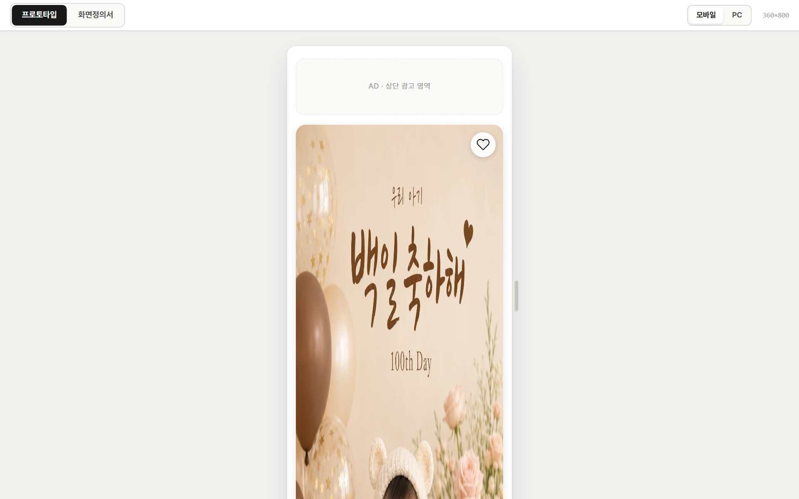
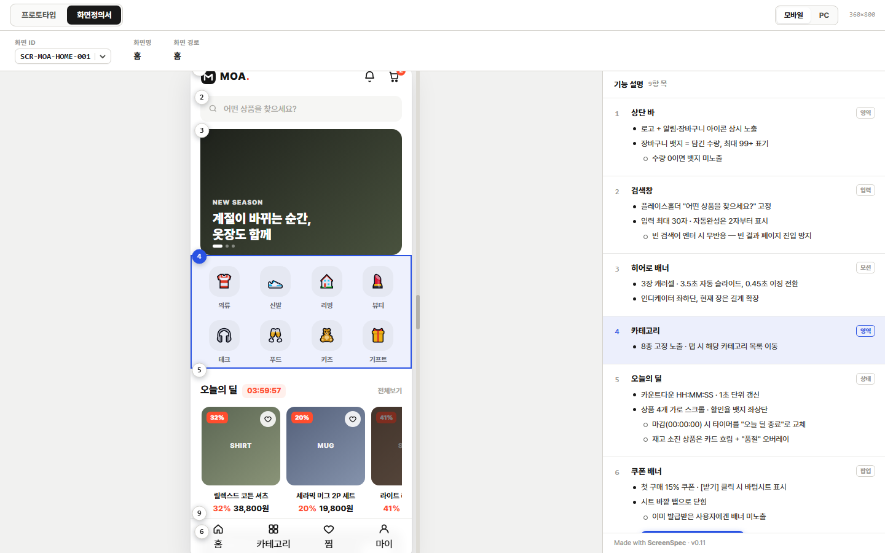

# ScreenSpec

**프로토타입이 그대로 화면정의서가 된다.**
HTML 프로토타입에 `<script>` 한 줄을 붙이면, 그 화면 위에 번호를 찍고 노션처럼 블록으로 설명을 쓸 수 있다.
캡처를 떠서 노션·컨플루언스에 번호를 붙이고 설명을 다는 작업이 통째로 없어진다.

[](LICENSE) [](https://cdn.jsdelivr.net/gh/charmisuk/screenspec@0/screenspec.js) [](https://github.com/charmisuk/screenspec/actions/workflows/ci.yml)

▶ **[라이브 데모 열기](https://charmisuk.github.io/screenspec/examples/shop.html)** — 상단 「화면정의서」 버튼을 눌러 보면 된다

| 프로토타입 모드 | 화면정의서 모드 |
|---|---|
|  |  |

---

## 이걸 왜 쓰나

**산출물이 둘이면 반드시 어긋난다.** 프로토타입을 고칠 때마다 캡처를 다시 뜨고, 번호를 다시 달고, 문서를 다시 맞춰야 한다. 그러다 한 번 건너뛰면 그때부터 문서는 거짓말을 시작한다.

ScreenSpec은 **산출물을 하나로 만든다.** 설명이 프로토타입 파일 안에 살고, 화면과 붙어 다닌다.

- **캡처가 없다** — 번호는 실제 요소에 붙는다. 화면이 바뀌면 번호도 따라간다
- **문서 모드에서도 프로토타입이 살아 있다** — 버튼이 눌리고 화면이 넘어간다
- **기획자가 직접 쓴다** — 코드를 열지 않는다. 노션처럼 눌러서 고친다

---

## 30초 만에 감 잡기

```text
1.  프로토타입 HTML 맨 아래에 <script> 한 줄을 붙인다
2.  브라우저로 연다 → 왼쪽 위 「화면정의서」를 누른다
3.  「화면에서 번호 찍기」 → 설명할 곳을 클릭 → 번호가 붙는다
4.  이름을 쓰고 Enter → 설명을 쓴다 (노션처럼)
5.  오른쪽 위 「자동저장 켜기」 → 그 뒤로는 알아서 저장된다
```

**3번이 이 도구의 시작점이다.** 이름표를 손으로 적지 않는다. 화면에서 고르면 라이브러리가 알아서 붙인다.

---

## 빠른 시작 (2분)

아래를 통째로 복사해 `test.html`로 저장하고 브라우저로 열면 끝이다. 설치할 것은 없다.

```html
<!doctype html>
<html lang="ko">
<body>
  <header data-spec="1">
    <h1>주간 리포트</h1>
    <p>8월 3주차</p>
  </header>
  <button id="save" data-spec="2" onclick="this.textContent='저장됨'">저장</button>

  <script>
  window.SCREENSPEC = {
    screen: { id: "SCR-RPT-001", name: "주간 리포트", path: ["홈", "리포트"] },
    specs: [
      { n: 1, target: "1", anno: "box", title: "상단 헤더", defs: [
        { t: "리포트 제목 + 조회 기간 표시" },
        { t: "기간은 이번 주 월요일 기준 자동 계산", c: [
          { t: "주간 회의가 월요일이라 그 주 기준이 자연스럽다", kind: "why" }
        ]}
      ]},
      { n: 2, target: "2", anno: "action", title: "저장 버튼",
        play: { selector: "#save", label: "동작 재생: 저장" }, defs: [
        { t: "탭 시 저장 후 버튼 문구가 '저장됨'으로 변경", c: [
          { t: "미입력 항목이 있으면 저장 차단" }
        ]}
      ]}
    ]
  };
  </script>
  <script src="https://cdn.jsdelivr.net/gh/charmisuk/screenspec@0/screenspec.js"></script>
</body>
</html>
```

이 코드가 하는 일:

1. 설명할 영역에 `data-spec="1"`, `data-spec="2"` 이름표를 붙였다 — **여기서는 손으로 적었지만, 실제로는 화면에서 찍으면 자동으로 붙는다**
2. `window.SCREENSPEC`에 화면 정보와 번호별 설명을 적었다. `c`는 **그 줄에 딸린 하위**다
3. 마지막 줄이 라이브러리다. 열면 위쪽에 **프로토타입 / 화면정의서** 토글이 생긴다

화면정의서 모드로 바꾸면 영역에 번호가 붙고 오른쪽에 기능 설명이 나온다.
1번의 마지막 줄은 `↳` 화살표로 한 단 안쪽에 붙고, 2번의 **▶ 동작 재생**을 누르면 실제로 저장 버튼이 눌린다.

**여기서부터는 코드를 안 봐도 된다.**

---

## 쓰는 법

| 하고 싶은 것 | 어떻게 |
|---|---|
| 설명 고치기 | 글자를 누르면 그 자리에서 써진다. 켜고 끄는 편집 모드가 없다 |
| **새 번호 붙이기** | **화면에서 번호 찍기** → 프로토타입에서 설명할 곳을 클릭 |
| 줄 늘리기 | `Enter`. 불릿은 `-`+스페이스, 화살표(`↳`)는 `>`, 그 밖엔 `/` 로 고른다 |
| 층 바꾸기 | `Tab` / `Shift+Tab`. 또는 왼쪽 `⠿` 를 잡아 끌면서 좌우로 민다 |
| 순서 바꾸기 | `⠿` 를 잡아 끈다. 다른 번호로도 옮겨진다 |
| 되돌리기 | `Ctrl+Z` · `Ctrl+Shift+Z` |
| **저장** | 오른쪽 위 **자동저장 켜기** → 이 HTML 파일을 한 번 고른다. 그 뒤로는 손이 멈출 때마다 저장되고 「저장됨」이 뜬다. **한 번 고른 파일은 기억한다** — 다음에 같은 문서를 열면 저절로, 또는 「이어서 저장」 한 번으로 이어진다 |
| 로컬 파일인데 아직 연결 안 됨 | **고쳐지지 않는다.** 고치려 하면 「이 파일을 한 번 골라 주세요」 띠가 뜬다. 남지 않을 수정을 하게 두지 않으려는 것이다 (주소로 받아 온 문서는 쓸 파일이 없으므로 막지 않는다) |
| 파일이 밖에서 바뀌면 | 띠가 뜬다: **새로고침**(밖의 변경을 본다) 또는 **내 것 유지**. 그동안 자동저장은 멈춘다 |
| 자동저장이 안 되는 브라우저 | **설명 복사** — 설정 블록을 통째로 복사해서 원본에 붙여넣거나 AI 에게 준다 |

자동저장은 파일에 직접 쓰는 브라우저 기능을 쓴다 — **크롬·엣지에서 로컬 파일**로 열었을 때다.

저장되는 것은 `window.SCREENSPEC` 블록 하나뿐이다. **프로토타입 코드는 한 글자도 건드리지 않는다.**

---

## 이 도구가 지키는 세 가지

**1. 프로토타입의 동작을 방해하지 않는다.**
정의서 모드에서도 버튼이 눌리고 화면이 넘어간다. 라이브러리는 위에 얹힐 뿐이다.

**2. 내가 옮긴 것 말고는 아무것도 안 바뀐다.**
블록 하나를 옮기거나 들여쓸 때, 남의 깊이도 남의 소속도 그대로다. 설명이 **트리**라서 부모가 «담김»으로 확정돼 있기 때문이다 — 계산으로 추측하지 않는다. 자리 272곳에서 이것을 기계로 잰다.

**3. 문서와 실물이 같은 파일에 있다.**
그래서 어긋날 방법이 없다. AI 가 그 파일의 프로토타입을 고쳐도 설명은 살아남는다.

---

## AI와 함께 쓰기

이 저장소에는 AI용 작업 지시서 [SKILL.md](SKILL.md)가 있다. 프로토타입을 만든 AI에게 이렇게 말하면 된다.

```
이 프로토타입에 ScreenSpec을 적용해줘.
https://github.com/charmisuk/screenspec 의 SKILL.md를 읽고 그대로 따라줘.
```

AI가 화면 ID 규칙·번호 부여·설명 작성 룰·자가 검증까지 따른다. 에이전트 진입점은 [AGENTS.md](AGENTS.md)·[llms.txt](llms.txt)에도 안내돼 있다.

**핑퐁이 된다.** 자동저장을 켜 두면 이렇게 돈다:

```text
내가 설명을 쓴다  →  파일에 저장된다
AI 가 그 파일의 프로토타입을 고친다  →  「밖에서 바뀌었습니다」 띠
새로고침  →  AI 가 고친 화면 + 내가 쓴 설명이 함께 있다
```

---

## 어디에 붙이나 — 세 가지 모드

| 모드 | 대상 | 붙이는 법 |
|---|---|---|
| `wrap` (기본) | 단일 HTML 프로토타입 | 위 빠른 시작 그대로. 기기 폭 시뮬레이터(모바일 360×800 · PC 1920×1080) 포함 |
| `overlay` | React · Next · Vue 등 | DOM을 건드리지 않고 얹기만 한다. 화면 구분은 라우트로 |
| `frame` | 프레임워크 앱 + 폭 확인·겹침 회피 | 앱을 액자(iframe)에 넣고 뷰어는 밖에. 설명 패널이 앱을 덮지 않고, 모바일/PC 전환이 앱의 미디어쿼리를 실제로 발화시킨다 |

wrap·overlay는 자동 감지되지만 명시가 안전하다(`frame`은 명시 전용).

```js
window.SCREENSPEC = {
  mode: "overlay",
  screens: [
    { id: "S-01", name: "대시보드", path: ["대시보드"], route: "/", specs: [] },
    { id: "S-09", name: "이용자 명단", path: ["이용자", "명단"], route: "/members", specs: [] }
  ]
};
```

Next.js(App Router) 적용법은 [SKILL.md](SKILL.md)에 스니펫이 있다.

---

## 무엇을 적을 수 있나

필드의 타입·기본값·필수 여부는 **[설정 레퍼런스](docs/config.md)** 한 장에 있다. 화면 목록 트리·액센트 컬러·CSS 훅·JS API·콘솔 경고도 거기 있다.

### 표현 타입 5종 (`anno`)

타입은 **결과가 달라질 때만** 나뉜다. 같은 결과면 하나다.

| 타입 | 언제 쓰나 |
|---|---|
| `box` | 기본값. 영역 설명 (입력 정책·애니메이션 정의도 여기에 그냥 쓴다) |
| `arrow` | 아이콘·버튼처럼 작아서 박스가 안 보일 때 |
| `state` | 조건부 표시·상태 분기 (로그인 여부, 빈 상태) — 대상이 화면에 없어도 누락 경고를 안 낸다 |
| `action` | 클릭 시 화면 안에서 동작 (모달·바텀시트 포함) → ▶ 실제 재생 |
| `flow` | 클릭 시 다른 화면으로 → ▶ 실제 이동 + 문서 동시 전환 |

옛 문서의 `input`·`motion` 은 `box` 로, `popup` 은 `action` 으로 그대로 열린다.

### 실무 화면정의서 문법

실무 화면정의서가 으레 갖는 구조를 설정 필드로 그대로 담는다. 전부 선택 사항이다.
(**어떤 말로 쓸지** — 접두사 어휘·항목 뼈대·화면 유형별 채울 것 — 는 [SKILL.md](SKILL.md)에 있다. AI가 그대로 따른다.)

| 하고 싶은 것 | 어떻게 | 화면에 어떻게 보이나 |
|---|---|---|
| 사양 밑에 딸린 세부 | 그 줄의 `c` 안에 넣는다 (또는 편집 중 `Tab`) | 한 단 들여쓴 블록. 부모를 옮기면 같이 따라간다 |
| 사양과 그 까닭을 갈라 쓰기 | `{ t: "「누가 오나」의 답이 아님", kind: "why" }` (또는 빈 줄에서 `>`) | `↳` 화살표로 작게 따라붙는다 — 구현자는 사양만, 검토자는 까닭까지 |
| 빈 상태·로딩·오류를 빠뜨리지 않기 | `checklist: ["빈 상태","로딩","오류"]` + 화면마다 `covers` / `skip` | 아직 안 적은 축이 목차에 `⚠ 로딩 · 오류 미정의`로 뜬다 |
| 평소엔 안 보이는 영역 (팝업 안 등) | `optional: true` | 누락 경고에서 빠지고 패널에 「현재 미표시」 |
| 빈 상태·오류를 글이 아니라 실물로 | `preview: { label: "빈 상태 보기" }` + 앱에 `screenspec:preview` 리스너 | 스위치를 켜면 앱이 그 상태를 재현하고 「재현 중」 띠가 뜬다 |
| 이 화면은 PC에서만 | `viewports: ["pc"]` | 목차에 「PC 전용」 배지 |
| 개발 정책·API를 같은 자리에 | `layer: "dev"` | 항목 안에 `DEV` 블록. 리뷰어는 「기획만」 칩으로 걸러 본다 |

**옛 문서도 그대로 열린다.** 예전 형식(깊이 숫자·중첩·까닭 속성)은 열 때 자동으로 지금 구조로 세워 읽는다.

---

## 만든 뒤 — 전달과 공개

### 전달할 때는 파일 하나로 뽑는다

위 방식은 열 때마다 인터넷에서 라이브러리를 가져온다. 만드는 중에는 편하지만 **남에게 넘길 문서**로는 두 가지가 걸린다. 인터넷이 막힌 곳(사내망·오프라인)에서 조용히 안 뜨고, 우리가 라이브러리를 고치면 이미 넘긴 문서가 몰래 바뀐다.

그래서 전달본은 라이브러리를 **파일 안에 넣어** 뽑는다.

```bash
node scripts/inline.js 내프로토타입.html     # → 내프로토타입.inline.html
```

나온 파일은 어디서든 열리고 그 시점 그대로 고정된다. 원본은 그대로 두고 전달본만 다시 뽑는 구조다.

| 방법 | 무엇이 고정되나 | 언제 |
|---|---|---|
| `@0` | 안 고정. 새 판이 나오면 자동으로 따라온다 | 지금 만지고 있는 프로토타입 |
| `@v0.25.0` 처럼 태그를 박는다 | 라이브러리가 그 판에 고정 | 오래 살릴 프로토타입 |
| [자체 완결 파일](#전달할-때는-파일-하나로-뽑는다) | 라이브러리가 **파일 안에 들어간다** | **남에게 넘기는 문서** |

**우리가 지키는 약속** — `@0` 을 쓰는 사람에게도 보장한다.

- **한 번 쓴 설정은 계속 읽힌다.** 새 필드가 생겨도 옛 설정은 그대로 동작한다
- **설정을 안 쓴 기능은 화면에 나타나지 않는다**
- 회귀 검사가 이걸 기계로 지킨다 — `examples/` 의 옛 문서들이 매 릴리스마다 전수 실행된다
- **바뀔 수 있는 것**: 버튼 자리·이름 같은 화면 배치. 이건 태그를 박거나 자체 완결 파일로 고정한다

### 정의서를 잠깐 끄기

정의서를 붙이는 것과 **공개하는 것**은 다른 결정이다. 초기 리뷰나 외부 데모에서는 프로토타입만 보여주고 싶을 수 있다.

```js
window.SCREENSPEC = { off: true, screens: [ /* 정의는 그대로 둔다 */ ] };
```

`off: true`면 라이브러리가 **아무것도 하지 않는다**. 그러고도 주소 끝에 `?screenspec=1`을 붙이면 나만 볼 수 있다. 반대로 그 탭에서만 끄려면 `?screenspec=0`.

단, 이건 **화면에서 감추는 것이지 파일에서 빼는 것이 아니다.** 정말 나가면 안 되는 내용이면 그 정의를 지운 사본을 따로 만들어 보낸다.

---

## 자주 막히는 곳

| 증상 | 원인·조치 |
|---|---|
| 아무것도 안 뜬다 | 콘솔 확인: `[ScreenSpec]` 메시지가 없으면 스크립트 로드 실패. `off` 표시가 있으면 정상이며 `?screenspec=1`로 켠다 |
| 「설정이 없습니다」 카드 | 스크립트만 넣고 `window.SCREENSPEC`을 안 적은 상태 |
| 번호가 안 보인다 | 화면정의서 모드에서만 보인다. 그래도 없으면 이름표(`data-spec`) 누락 — 콘솔 경고 확인 |
| 찍은 번호가 다시 열면 사라진다 | 저장을 안 한 것. 로컬 파일이면 애초에 연결 전에는 고쳐지지 않는다. 주소로 연 문서라면 「설명 복사」로 원본에 붙여넣는다 |
| 저장할 파일을 잘못 골랐다 | 안 쓴다. 고른 파일의 화면 ID 가 이 문서와 하나도 안 겹치면 「이 화면정의서의 파일이 아닙니다」로 멈춘다. 설정이 없는 파일도 마찬가지 |
| 「자동저장 켜기」가 안 눌린다 | 파일에 직접 쓰는 기능이 없는 브라우저다. 크롬·엣지에서 열거나 「설명 복사」를 쓴다 |
| 목차에서 화면을 골라도 프로토타입이 그대로 | 그 화면에 `root`를 안 적은 것. 정의가 가리키는 요소로 되찾아 보고, 그래도 모르면 콘솔로 알린다 (전환 알림에도 「설명만」으로 뜬다) |
| 화면이 바뀌어도 문서가 그대로 | 자동 감지 실패. `root`(단일 HTML)나 `route`(프레임워크) 지정, 또는 `ScreenSpec.setScreen(id)` 호출 |
| 프레임워크 화면이 깨진다 | wrap으로 붙은 것. `mode: "overlay"` 명시 |
| 앱의 오른쪽 서랍이 패널에 가려진다 | `mode: "frame"` — 뷰어가 앱 밖에 있어 겹칠 수 없다 |
| 넘긴 문서가 나중에 달라져 있다 | CDN 한 줄짜리 원본을 넘긴 것. 전달은 항상 `.inline.html`로 |
| 상태 정의는 적었는데 번호가 없다 | 지금 화면에 그 상태가 안 떠 있는 것. 「현재 미표시」로 구분된다 (정상) |

---

## 예제

- [shop.html](https://charmisuk.github.io/screenspec/examples/shop.html) — 대표 데모. 이커머스 2화면, anno 5종 전부, PC 반응형
- [tree.html](https://charmisuk.github.io/screenspec/examples/tree.html) — 화면 목록 트리 (10화면·4뎁스·미정의 혼합)
- [demo.html](https://charmisuk.github.io/screenspec/examples/demo.html) — 단일 화면 (콘텐츠형)
- [multi-screen.html](https://charmisuk.github.io/screenspec/examples/multi-screen.html) — 다중 화면 + flow·action
- [overlay-spa.html](https://charmisuk.github.io/screenspec/examples/overlay-spa.html) — 오버레이 모드 (React·Next와 같은 구조)
- [floating.html](https://charmisuk.github.io/screenspec/examples/floating.html) — 고정·플로팅 요소 (앱바·FAB·탭바·전면 시트)

---

## 개발

```bash
node tests/lint.js  # 문법·버전 정합·문서 드리프트 (의존성 없음)
node tests/e2e.js   # 브라우저 회귀 (playwright 필요)
node tests/smoke.js # 예제 전수 클릭 (playwright 필요)
```

필요할 때만 켜는 것 — 블록 위계 규칙을 손댔을 때:

```bash
node tests/e2e.js --grid   # 자리 272곳 전수 검증 (느려서 평소엔 건너뛴다)
node scripts/qa-drag.js    # 같은 검사 + 사람이 볼 리포트 (_qa/drag-report.html)
```

모든 push·PR·태그에서 GitHub Actions가 lint·e2e·smoke 셋을 돌린다. CI가 빨간 상태로는 릴리스하지 않는다.
문서도 검사 대상이다 — 이 README의 빠른 시작 예제는 CI가 실제로 실행해 보고, 설정 필드가 레퍼런스에서 빠지면 실패한다.

버그·요청은 [이슈](https://github.com/charmisuk/screenspec/issues)로. 변경 이력은 [CHANGELOG.md](CHANGELOG.md).

## 라이선스

MIT © ScreenSpec
